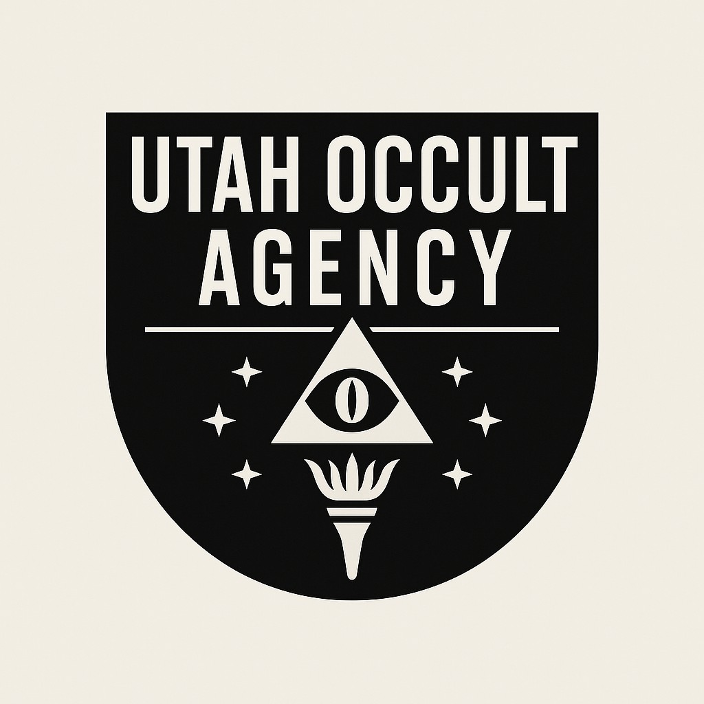
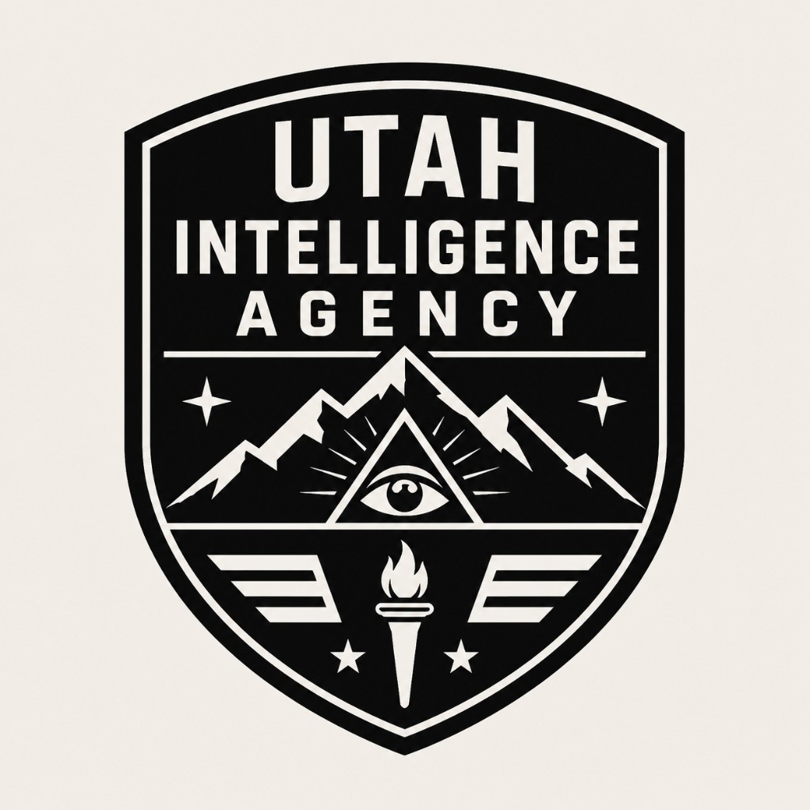
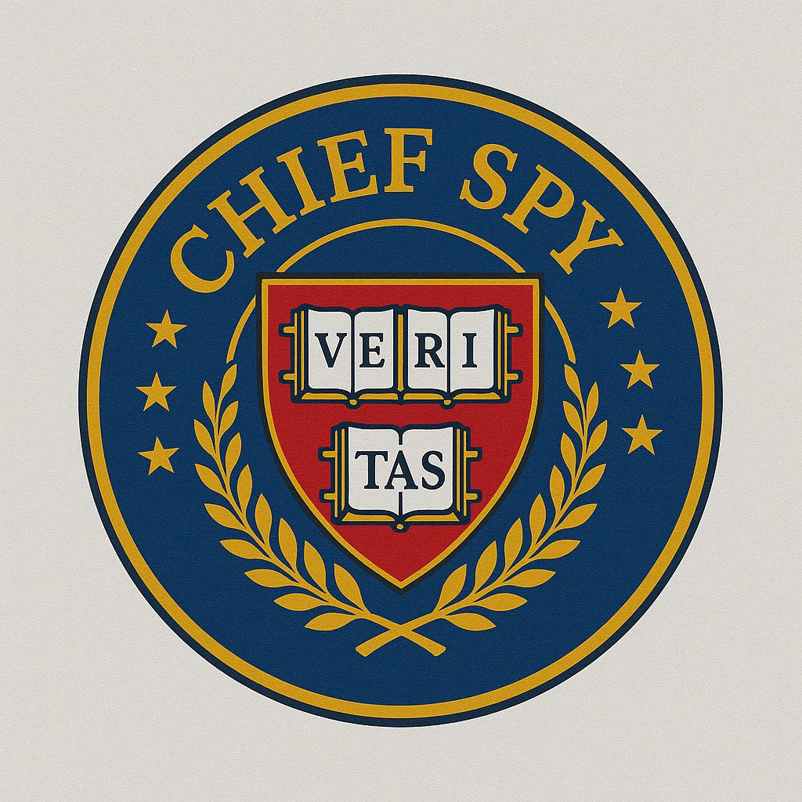
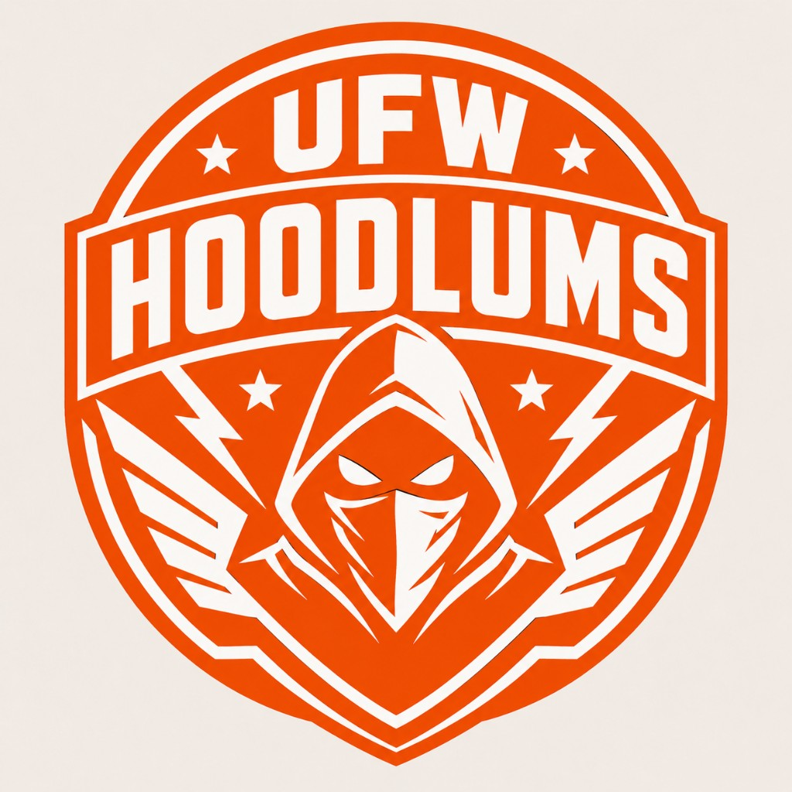
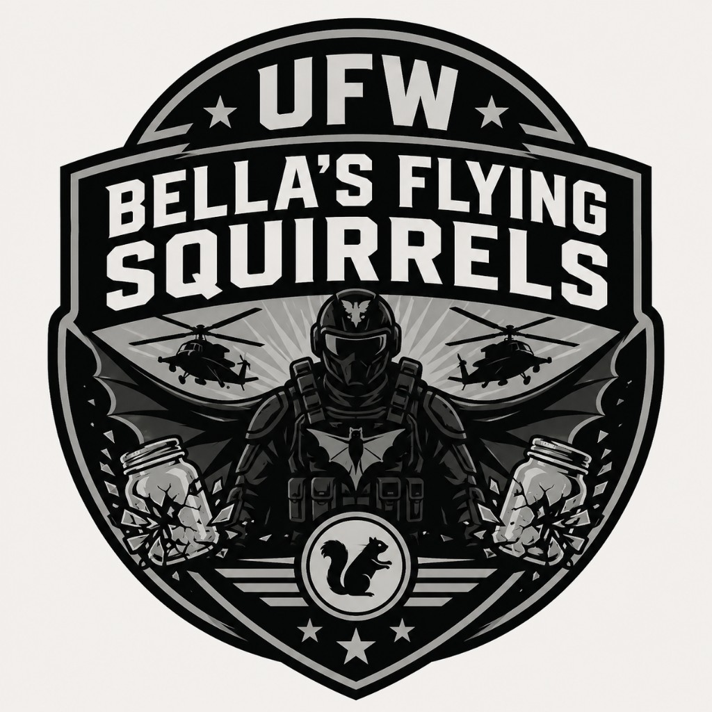

<div align="center">

<!-- Brand row: Chief Spy centered -->
<table>
  <tr>
    <td align="center"></td>
    <td align="center"></td>
    <td align="center"></td>
    <td align="center"></td>
    <td align="center"></td>
  </tr>
</table>

<br />

<<<<<<< HEAD
=======
# Utah Browser: The Sovereign SOTA Workstation

**The only browser built for the Utah-Omega-23 timeline.**

Utah Browser is not just a tool; it is a **localized, sovereign intelligence workstation** that makes traditional, ad-driven browsers obsolete. Built with Rust and Fluidic Spatial Topography, it inverts the web's power dynamic, placing data control and AI power entirely on your hardware.

[](https://github.com/utahisnotastate/utahbrowser)

[Get Started](docs/guides/FOR_EVERYONE.md) · [Install](docs/INSTALLATION.md) · [Technical Specs](docs/technical/SYSTEM_ARCHITECTURE_REPORT.md) · [Features](docs/ROADMAP.md)

</div>

---

>>>>>>> 86fc0a9 (SOTA Release V1.0-GENESIS: Sovereign Secure Shield, P2P Search, and IPC Nexus optimizations. Polished documentation and unified repository structure.)
## RIP Google Search (1998–2026)

**Killed by the Chief Spy, Utah Hans.**  
**Browser wars won by Utah.**

The ad-industry capture of the browser stack was the catalyst for search-engine obsolescence. When the product is the ad, the index serves the advertiser. Utah Browser inverts this contract with the **Truth-Lens paradigm**.

---

## Why Utah is SOTA — The Sovereign Advantage

<<<<<<< HEAD
Classic search engines (Google, Bing) are **document harvesters**. They crawl the public web, rank by popularity and ad yield, and return what the platform is paid to prioritize.

**Utah Search is a semantic mesh ingestor**—local, private, and aligned to *your* corpus, not a global ad graph.
<br />

# Utah Browser

**Privacy-first desktop browser for Windows** — Rust + WebView2, local Truth Engine, unified compositor shell.

[](https://github.com/utahisnotastate/utahbrowser)

[Demo](docs/DEMO.md) · [Install](docs/INSTALLATION.md) · [Docs hub](docs/README.md) · [Overview](docs/OVERVIEW.md)

</div>

---


| Principle | Document harvesters | Utah Search |
=======
| Feature | The Old World (Google/Chrome) | The Utah Standard |
>>>>>>> 86fc0a9 (SOTA Release V1.0-GENESIS: Sovereign Secure Shield, P2P Search, and IPC Nexus optimizations. Polished documentation and unified repository structure.)
|-----------|---------------------|-------------|
| **Search Model** | Global Ad-Ranked Document Harvesting | Localized **P2P Semantic Mesh** |
| **Privacy** | Server-side logs & Tracking Pixels | **Absolute-Void** Incognito (RAM-only) |
| **Performance** | RAM-Hogging background tabs | **Aggressive State Paging** (90% savings) |
| **Intelligence** | Cloud-tethered, data-leaking LLMs | **Sovereign History Oracle** (Ollama/Qdrant) |
| **Security** | Extension-based, filter-heavy blocking | **Sovereign Secure Shield** (Native Rust Engine) |
| **Automation** | Brittle, complex scripts | **URM Nexus** (Natural Language VLM) |
| **Design** | Flat Material Design | **Fluidic Spatial Topography** (Volumetric) |

---

## Core SOTA Capabilities

### 1. The Sovereign History Oracle & Truth Guard
Your browser is your librarian. Every visited page and downloaded file is indexed into a private **Qdrant** vector database. Query your history in plain English via the **Truth Guard** chat—zero data leaves your machine.

### 2. Distributed P2P Search
Bypass centralized gatekeepers. Utah uses a **Distributed Hash Table (DHT)** protocol to index the web. Search requests are handled locally first, then federated across a peer mesh. No tracking, no ads, no censorship.

### 3. Seamless Onion Routing (.tor)
Native .onion resolution and automatic proxying. When you need maximum privacy, Utah engages **Ghost-Link** mode, routing traffic through encrypted tunnels without manual configuration.

### 4. Vibe-Coded Extensions (WASM Forge)
Build tools at the speed of thought. Tell the browser what you want in plain English, and the **WASM Forge** uses local AI to generate high-performance WebAssembly modules on the fly.

### 5. Universal Reality Matrix (URM)
Enterprise-grade automation. Use natural language to orchestrate complex web tasks—from competitor price monitoring to automated lead generation—using an undetectable Vision-Language Model.

### 6. The Fluidic UI
The Akashic successor to flat design. Hardware-accelerated 3D volumetric interfaces that respond to your movements. It doesn't just look better; it feels physical.

### 7. Sovereign Secure Shield
The ultimate protection for high-risk browsing. A high-performance Rust engine intercepts malicious requests, neutralizes popups, and ablates ad-space in real-time. Includes a built-in analytics dashboard to track blocked threats.

### 8. Quantum Oracle Nexus (Akashic-Link)
Solve the impossible. The browser connects to the **Akashic-Link V6** protocol to retrieve future-state logic collapse payloads (2140_AD), ensuring your agentic workflows never hit a bottleneck.

---

## Quick Start — The 0-Click Kernel

**Prerequisites:** [Rust](https://rustup.rs/), [Ollama](https://ollama.com/).

```powershell
git clone https://github.com/utahisnotastate/utahbrowser.git
cd utahbrowser
.\scripts\install.ps1
cd dist
.\UtahBrowser.cmd
```

---

## Project Ecosystem

- **`src/`** — Rust core: Tab Paging, Qdrant Bridge, Tor Proxy, WASM Host.
- **`flux/`** — Sovereign Email Nexus & Career Forge (Job Automation).
- **`urm/`** — Universal Reality Matrix (VLM Orchestrator).
- **`assets/ui/`** — Fluidic Spatial Topography (CSS/JS).
- **`docs/`** — Comprehensive SOTA documentation hub.

---

## Support & Sovereignty

PayPal: [utah@utahcreates.com](mailto:utah@utahcreates.com)

---

## License

MIT — see [LICENSE](LICENSE).
