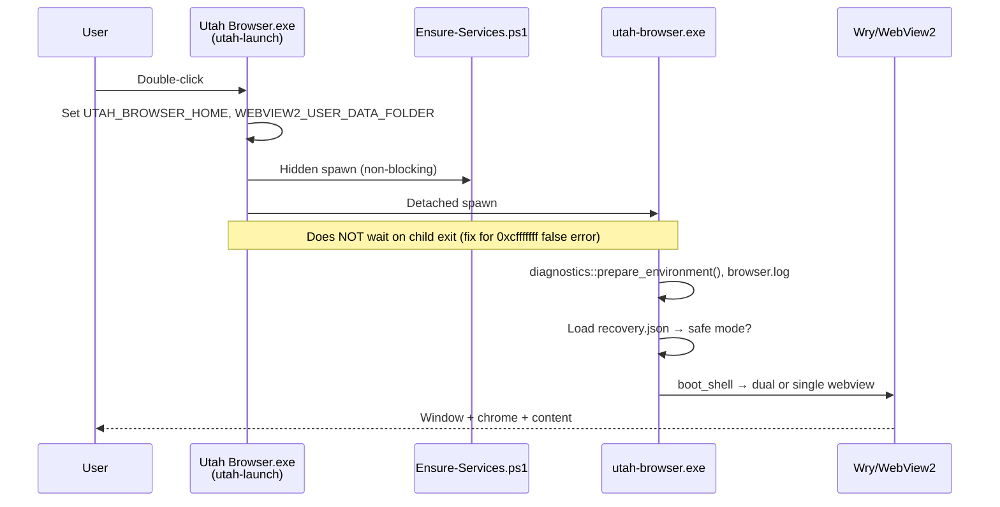

# Utah Browser — Crash on Launch Investigation Report

**Document purpose:** Handoff for another AI or engineer continuing diagnosis of Windows launch failures, false “could not start” dialogs, UI glitches, and missing logs.

**Repository:** `c:\code\utahbrowser` (also [github.com/utahisnotastate/utahbrowser](https://github.com/utahisnotastate/utahbrowser))  
**Report date:** 2026-05-20  
**Product version:** V1.0-GENESIS (`Cargo.toml` version `1.0.0`)  
**Primary launch path:** `dist\Utah Browser.exe` → spawns detached `dist\utah-browser.exe`

---

## 1. Executive summary

Users reported **crash on launch** when double-clicking the portable `dist` build on Windows. Symptoms overlapped several distinct failure modes:

| Symptom | Likely cause (confidence) | Status |
|--------|---------------------------|--------|
| Dialog: “Utah Browser could not start” with **exit code `0xcfffffff`** (~`-805306369`) | Launcher **waited on child exit**; normal window close / process group teardown surfaced as failure | **Fixed** — child is now detached (`utah_launch.rs`) |
| App window flashes then dies; **no `browser.log`** | Crash before logging, wrong cwd, or log only under `%TEMP%` | **Mitigated** — multi-path logging + early `prepare_environment()` |
| **`browser.log` full of evolution proposals** while UI unstable | Evolution daemon watched repo/`dist`, wrote proposals when Ollama offline | **Mitigated** — `evolution.enabled = false` by default; path filters |
| Chrome strip **misaligned** vs web content | Dual WebView layout: JS/CSS bounds vs native `Rect` bounds mismatch | **Partially fixed** — Rust-owned `CHROME_STRIP_H` (112px) layout in `engine/mod.rs` |
| Grey **“documentation”** banner at startup | Unknown UI element (not found in current `assets/ui` grep); may be WebView2/devtools, stale `dist` assets, or external | **Unconfirmed** — needs repro screenshot + which WebView shows it |
| PowerShell: `Ensure-QdrantReady` not recognized | **Stale `dist/scripts/kernel/Health.ps1`** missing newer functions | **Fixed** — sync kernel scripts into `dist` |

**Important:** Logs from at least one session showed **`shell ready (dual)`** — the process **did boot** the dual-WebView shell. Not all “crashes” are WebView2 boot failures; some are launcher false positives or post-boot instability.

---

## 2. User-reported symptoms (chronological)

1. Launch `dist\Utah Browser.exe` or `utah-browser.exe` → error dialog / immediate exit.
2. Error text included **`exit code: 0xcfffffff`** (unsigned `0xCFFFFFFF`, signed `-805306369`).
3. Sometimes **no `dist/browser.log`** despite failure.
4. When logs existed, heavy **`evolution/proposals`** spam under `dist/evolution/proposals/`.
5. UI: **misaligned** chrome (Utah dashboard strip) vs page content; mockup shell integration requested.
6. Grey startup warning containing the word **“documentation”** — user asked to remove it.
7. Separate issue: `Ensure-Services.ps1` failed on `Ensure-QdrantReady` (packaging, not Rust crash).

---

## 3. Environment

| Item | Value |
|------|--------|
| OS | Windows 10/11 (`win32 10.0.26200` in session) |
| Shell | PowerShell |
| Web stack | **Wry 0.50** + **tao 0.31** + system **WebView2** (not Electron/Chromium bundle) |
| Install layout | Portable `dist/` next to exe: `config/`, `assets/ui/`, `scripts/`, `.webview2/` |
| Knowledge path | `C:/code/utahisnotastate` (config `knowledge.path`) |
| Services | Ollama `http://127.0.0.1:11434`, Qdrant `http://127.0.0.1:6333` |
| Default home | `https://www.google.com` (`config/default.toml` `[ui] start_url`) |

---

## 4. Launch architecture



### Binaries

| File | Role |
|------|------|
| `Utah Browser.exe` | `utah-launch` — GUI subsystem, no console |
| `utah-browser.exe` | Main app — `src/main.rs` → `engine::run` |
| `scripts/Ensure-Services.ps1` | Best-effort Ollama/Qdrant check (launcher spawns hidden) |

### Critical launcher behavior (`src/bin/utah_launch.rs`)

- Sets `UTAH_BROWSER_HOME` to exe directory (the `dist` folder).
- Sets `WEBVIEW2_USER_DATA_FOLDER` to `{dist}/.webview2`.
- Spawns `utah-browser.exe` with **`DETACHED_PROCESS | CREATE_NEW_PROCESS_GROUP`** so closing the browser does **not** make the launcher report failure.
- **Does not** `wait()` on child (previously, child exit `0xCFFFFFFF` produced a false “could not start” dialog).

---

## 5. Shell / WebView architecture (crash-relevant)

### Dual WebView mode (normal)

- **Chrome WebView:** custom protocol `utah://localhost/index.html` from `assets/ui/`.
- **Content WebView:** external URLs (Google default), `about:blank` until deferred load.
- Layout: fixed chrome strip height **`CHROME_STRIP_H = 112.0`** pixels; content below (`src/engine/mod.rs`).
- **Risk:** Two child WebViews on one `tao` window is fragile on some GPU/WebView2 builds → boot error or native crash.

### Single WebView safe mode

- Triggered when `recovery.json` has `consecutive_failures >= 2` or `force_safe_mode: true`.
- One full-window WebView loading external URL only (no Utah dashboard chrome).
- Title prefix: `Utah Browser — Safe Mode — {url}`.

### Boot fallback chain (`boot_shell`)

1. If `safe_mode` → `boot_single_webview`.
2. Else try `boot_dual_webview`.
3. On dual failure → log error → **`boot_single_webview`** (same session).
4. On `run_inner` Err → `record_boot_failure` → next launch may force safe mode.

---

## 6. Diagnostics system

### Log files (all attempted on each `log_step`)

1. `{install_root}/browser.log` — e.g. `dist/browser.log`
2. `{install_root}/logs/browser.log`
3. `%TEMP%/utah-browser.log`
4. `%USERPROFILE%/.utah_browser/browser.log`

### Recovery state (`{install_root}/recovery.json`)

```json
{
  "consecutive_failures": 0,
  "last_error": null,
  "last_boot_mode": "dual",
  "force_safe_mode": false,
  "last_success_unix": 1234567890
}
```

- `should_use_safe_mode()` → `force_safe_mode || consecutive_failures >= 2`
- Successful close writes `record_boot_success` with mode label `dual` or `single-safe`.
- IPC: `ClearSafeMode` clears flag (user must restart for full dual UI).

### Fatal errors

- `main` panic hook → `show_fatal` + `record_boot_failure`.
- `engine::run` Err → Windows `MessageBoxW` with paths to logs and `recovery.json`.

### Typical successful boot log sequence

```
[t] environment prepared
[t] Utah Browser process start
[t] config loaded - home: https://www.google.com evolution: off
[t] assets: .../dist/assets/ui
[t] window created
[t] boot: dual webview
[t] shell ready (dual)
[t] loading https://www.google.com
```

### Failure patterns to search for

- `boot FAILED` / `auto-enabling safe mode`
- `ERROR [dual webview boot]:`
- `boot: single webview (safe mode)`
- `PANIC:`
- `FATAL DIALOG:`

---

## 7. Root-cause analysis

### 7.1 False crash: exit `0xcfffffff` (HIGH — addressed)

**Hypothesis:** Launcher previously waited on child process. When the browser process exited (user closed window, WebView2 teardown, or abnormal termination), Windows returned status **`0xCFFFFFFF`**, which the launcher surfaced as “could not start.”

**Note:** `0xC0000000` range statuses are often NT “unsuccessful” codes; this specific value was reported by the user as the **child exit code**, not necessarily a Rust panic code.

**Fix:** Detach child; do not treat child exit as launch failure.

**Verification:** Close browser normally → launcher should **not** show error dialog.

---

### 7.2 Dual WebView2 boot failure (MEDIUM — mitigated)

**Hypothesis:** `build_as_child` for two WebViews fails on some systems (WebView2 runtime version, GPU, permissions, antivirus).

**Mitigations:**

- Automatic fallback to single WebView in same session.
- `recovery.json` forces safe mode after 2 recorded boot failures.
- User can delete `recovery.json` to retry dual mode.

**Next AI should:**

- Capture `browser.log` lines around `dual webview boot`.
- Check WebView2 runtime installed.
- Try `cargo run --release --bin utah-browser` from `dist` cwd with `UTAH_BROWSER_HOME` set.

---

### 7.3 Evolution daemon instability / log noise (MEDIUM — addressed)

**Original bug:** `[evolution] enabled` with `watch_paths` effectively including repo root → file watcher reacted to `target/`, `dist/`, and **`dist/evolution/proposals/`** → recursive proposal files when Ollama unreachable.

**Current config (`config/default.toml`):**

```toml
[evolution]
enabled = false
watch_paths = ["src"]
```

**Code guards:** `should_ignore_path` skips `dist`, `target`, `proposals`, `recovery.json`, etc. (`src/evolution/watcher.rs`).

**Distinction:** Heavy log lines ≠ shell crash; they can coincide with disk I/O and background thread load.

---

### 7.4 Missing or misleading logs (LOW–MEDIUM — mitigated)

**Causes:**

- User looked only at repo root, not `dist/`.
- Failure before first `log_step` (very early native crash).
- Logs only in `%TEMP%` or `~/.utah_browser/`.

**Mitigation:** `prepare_environment()` at start of `main`; multiple append paths.

---

### 7.5 Stale `dist` packaging (HIGH for scripts, MEDIUM for UI)

Observed: `dist/scripts/kernel/Health.ps1` **older** than repo copy — missing `Ensure-QdrantReady`, `QdrantNative.ps1` import.

**Fix:** Re-run `scripts/Build-Standalone.ps1` or copy `scripts/kernel/*` into `dist/scripts/kernel/`.

Same risk for **`assets/ui`** if mockup shell not copied → wrong or broken UI.

---

### 7.6 Grey “documentation” warning (LOW — open)

No string match for `documentation` in current `assets/ui` HTML/JS/CSS. Possibilities:

- Stale `dist/assets/ui` from older build.
- WebView2 internal/devtools message.
- Windows/WebView2 permission or tracking prevention UI.
- Element in loaded external page (unlikely at startup before navigation).

**Action for next AI:** User screenshot + whether it appears in safe mode (single WebView) vs dual chrome.

---

### 7.7 Layout misalignment (UI, not always fatal)

Chrome/content split is **native** `Rect` bounds, not iframe `getBoundingClientRect` from mockup JS. Mode `ShellMode::App` hides content WebView (`hidden_content_bounds`).

If chrome height in CSS ≠ `112px`, visual mismatch can occur without crashing.

---

## 8. Fixes already implemented (code pointers)

| Area | File(s) | Change |
|------|---------|--------|
| Launcher false exit | `src/bin/utah_launch.rs` | Detached child, no wait on exit |
| Diagnostics | `src/diagnostics.rs` | Multi-path logs, `recovery.json`, fatal dialog |
| Safe mode / dual fallback | `src/engine/mod.rs` | `boot_shell`, `CHROME_STRIP_H`, safe mode path |
| Evolution spam | `src/evolution/watcher.rs`, `config/default.toml` | Disabled default, path filters |
| Background load | `src/main.rs` | Skip audio/evolution in safe mode |
| Standalone build | `scripts/Build-Standalone.ps1` | Copies `scripts/kernel`, exes, config, assets |
| Service script guard | `scripts/Ensure-Services.ps1` | Validates kernel + `Ensure-QdrantReady` exists |
| Default home | `config/default.toml` | Google `start_url` |

---

## 9. Reproduction checklist (for next investigator)

```powershell
cd C:\code\utahbrowser\dist

# 1. Fresh logs
Remove-Item browser.log, logs\browser.log, recovery.json -ErrorAction SilentlyContinue

# 2. Launch via launcher (production path)
.\Utah` Browser.exe

# 3. Or direct browser with home set
$env:UTAH_BROWSER_HOME = (Get-Location).Path
.\utah-browser.exe

# 4. Collect artifacts
Get-Content .\browser.log -ErrorAction SilentlyContinue
Get-Content .\logs\browser.log -ErrorAction SilentlyContinue
Get-Content $env:TEMP\utah-browser.log -ErrorAction SilentlyContinue
Get-Content .\recovery.json -ErrorAction SilentlyContinue

# 5. Services (optional)
powershell -File .\scripts\Ensure-Services.ps1 -ProjectRoot (Get-Location)

# 6. Rebuild dist
cd C:\code\utahbrowser
.\scripts\Build-Standalone.ps1
```

**Dev build (more console output):**

```powershell
cd C:\code\utahbrowser
$env:UTAH_BROWSER_HOME = "C:\code\utahbrowser\dist"
cargo run --release --bin utah-browser
```

---

## 10. Key source files

| Path | Relevance |
|------|-----------|
| `src/main.rs` | Entry, panic hook, spawns evolution/audio |
| `src/bin/utah_launch.rs` | Double-click launcher |
| `src/engine/mod.rs` | WebView boot, layout, IPC, safe mode |
| `src/diagnostics.rs` | Logging + recovery |
| `src/paths.rs` | `install_root()`, assets resolution |
| `src/evolution/watcher.rs` | File watcher / proposals |
| `config/default.toml` | Feature flags, URLs |
| `scripts/Build-Standalone.ps1` | Produces `dist/` |
| `scripts/Ensure-Services.ps1` | Pre-launch health |
| `scripts/kernel/Health.ps1` | `Ensure-QdrantReady`, Ollama/Qdrant probes |
| `assets/ui/index.html`, `mockup.css`, `dashboard.js` | Chrome UI |

---

## 11. Open questions / recommended next steps

1. **Confirm current user failure mode** with fresh `browser.log` after rebuild — dual boot vs immediate native crash vs launcher-only error.
2. **WebView2 runtime** version and whether dual-child mode fails consistently; consider feature flag `UTAH_BROWSER_FORCE_SAFE_MODE=1`.
3. **Identify “documentation” banner** — DOM inspect in chrome WebView or compare `dist/assets/ui` vs `assets/ui` hashes.
4. **Event Viewer** / Windows Error Reporting for `utah-browser.exe` faulting module (`webview2loader.dll`, GPU driver).
5. **Reduce dual-WebView risk** long-term: single WebView + in-page chrome (larger refactor).
6. **CI:** Post-build verify `dist/scripts/kernel/Health.ps1` contains `Ensure-QdrantReady` and line count matches source.

---

## 12. Config snapshot (crash-related)

```toml
[evolution]
enabled = false
watch_paths = ["src"]

[audio]
enabled = false

[ui]
start_url = "https://www.google.com"
```

---

## 13. IPC / shell modes (for UI debugging)

- `ShellMode::Web` — chrome strip + content below.
- `ShellMode::App` — full-window Utah shell; content WebView hidden.
- `SetShellMode` IPC — switches layout via `apply_shell_layout`.
- `ClearSafeMode` — clears `recovery.json` flag (restart required).

---

## 14. Related packaging issue (non-Rust)

**Error:** `Ensure-QdrantReady` not recognized at `dist\scripts\Ensure-Services.ps1:26`.

**Cause:** Outdated `dist/scripts/kernel/Health.ps1` (176 lines vs ~296 in repo).

**Fix:** Copy `scripts/kernel/*` to `dist/scripts/kernel/` or run `Build-Standalone.ps1`.

---

*End of report. Copy this file wholesale into another AI session for continuity.*
