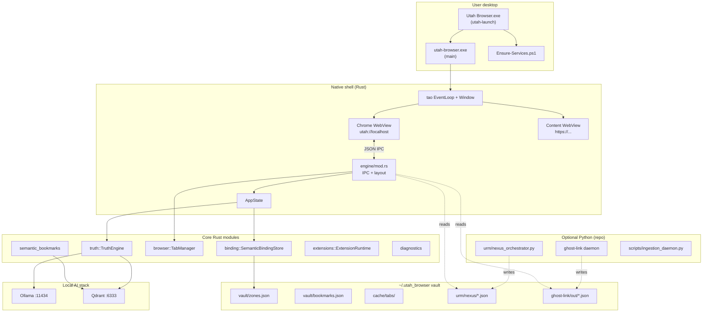
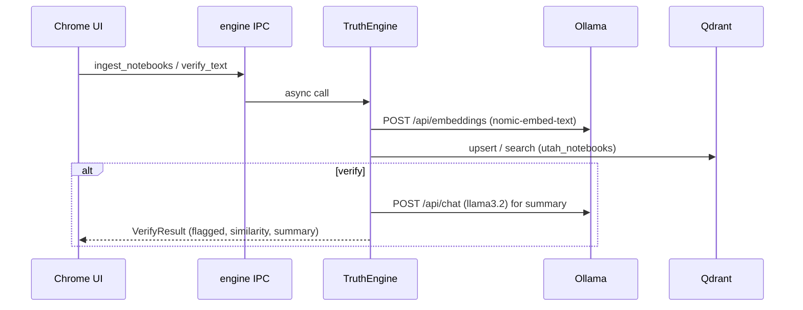

# Utah Browser — System Architecture & Technical Design Report

**Document purpose:** Complete handoff for another AI or engineer — current architecture, components, data flows, configuration, and extension points.

**Repository:** `c:\code\utahbrowser` — [github.com/utahisnotastate/utahbrowser](https://github.com/utahisnotastate/utahbrowser)  
**Version:** V1.0-GENESIS (`Cargo.toml` `1.0.0`)  
**Report date:** 2026-05-20  
**Companion doc:** [CRASH_ON_LAUNCH_REPORT.md](./CRASH_ON_LAUNCH_REPORT.md) (launch failures only)

---

## 1. Product summary

**Utah Browser** is a privacy-first **native desktop web shell** (Rust + Wry/WebView2 on Windows), not Electron/Chromium. It wraps:

1. **Browsing** — multi-tab navigation with a custom chrome UI and a separate content WebView for external sites.
2. **Truth Engine** — local RAG over a user knowledge corpus via **Ollama** (embed + chat) and **Qdrant** (vectors).
3. **Spatial graph UX** — tabs as “memory bricks,” semantic bookmarks, optional Wasm extensions.
4. **Optional satellites** — Python **URM** (Nexus orchestrator), **Ghost-Link** sensory daemon, **evolution** code watcher, **audio** scaffold — integrated via JSON files in a local vault, not cloud APIs.

**Design principle:** No telemetry, no cloud API keys in the app layer; services run on `127.0.0.1`.

---

## 2. High-level architecture



---

## 3. Repository layout

| Path | Role |
|------|------|
| `src/` | Rust application (library + 2 binaries) |
| `src/main.rs` | `utah-browser` entry: tracing, `AppState`, `engine::run` |
| `src/bin/utah_launch.rs` | `Utah Browser.exe` — detached spawn, service bootstrap |
| `src/lib.rs` | Crate modules + `AppState` |
| `src/engine/mod.rs` | Window, dual/single WebView, IPC dispatch, shell layout |
| `src/truth/` | Ingest, embed, verify, Ollama/Qdrant HTTP clients |
| `src/browser/` | Tabs, bookmarks, prefetch, Wasm extensions, vault paths |
| `src/binding/` | Cognitive zones, telemetry, folder picker ingest |
| `src/ipc/messages.rs` | Typed IPC request/event enums (serde JSON) |
| `src/diagnostics.rs` | Multi-path `browser.log`, `recovery.json`, fatal dialogs |
| `src/paths.rs` | `install_root()`, portable `config/` + `assets/` resolution |
| `src/evolution/` | File watcher → Ollama proposals (off by default) |
| `src/audio/` | `cpal` capture scaffold |
| `src/ghost_link/` | Read Ghost-Link vault JSON |
| `src/urm/` | Read URM/Nexus vault JSON |
| `assets/ui/` | Chrome HTML/CSS/JS (served via `utah://`) |
| `config/default.toml` | Single source of truth for runtime config |
| `scripts/` | PowerShell Zero-Click Kernel, Qdrant native, build |
| `urm/` | Python Nexus orchestrator (optional) |
| `dist/` | Portable build output (gitignored; produced by install/build) |
| `docs/` | User + technical documentation |

---

## 4. Binaries and process model

| Binary | Cargo target | User-facing name | Behavior |
|--------|--------------|------------------|----------|
| `utah-browser` | `src/main.rs` | `utah-browser.exe` | Full app: WebView loop, IPC, Truth Engine |
| `utah-launch` | `src/bin/utah_launch.rs` | `Utah Browser.exe` | Sets `UTAH_BROWSER_HOME`, `WEBVIEW2_USER_DATA_FOLDER`; hidden spawn of `Ensure-Services.ps1`; **detached** spawn of `utah-browser.exe` (no wait on child exit) |

**Threading:**

- **Main thread:** `tao` / Wry event loop (must own UI).
- **Tokio** `multi_thread` runtime: `block_on` inside IPC handlers for async Truth/Qdrant/Ollama work.
- **Background threads:** evolution watcher, audio listener (when enabled), optional Python daemons via `Command::spawn`.

---

## 5. Install root vs user vault (two storage tiers)

### 5.1 Install root (`UTAH_BROWSER_HOME` / exe directory)

Portable layout used at runtime for read-only packaged assets:

```
dist/                          # typical install_root
├── Utah Browser.exe           # launcher
├── utah-browser.exe
├── config/default.toml
├── assets/ui/                 # chrome UI
├── scripts/
│   ├── Ensure-Services.ps1
│   └── kernel/                # Health.ps1, QdrantNative.ps1, ...
├── .webview2/                 # WebView2 user data
├── browser.log                # diagnostics (also mirrored elsewhere)
├── recovery.json              # safe-mode state
└── evolution/proposals/       # if evolution enabled
```

Resolution: `src/paths.rs` — `install_root()` prefers `UTAH_BROWSER_HOME`, else exe parent if `config/` or `utah-browser.exe` present, else `CARGO_MANIFEST_DIR` (dev).

### 5.2 User vault (`~/.utah_browser`)

Writable per-user state (`src/browser/storage_bridge.rs`):

| Subpath | Contents |
|---------|----------|
| `vault/zones.json` | Semantic binding zones (cognitive folders) |
| `vault/bookmarks.json` | Local bookmark index |
| `vault/ingestion_watch.json` | Ingestion daemon hints |
| `cache/tabs/tab_{id}.bin` | Serialized suspended tab state (bincode) |
| `extensions/` | Wasm extension modules + manifests |
| `logs/` | Vault logs |
| `ghost-link/out/` | `prefetch.json`, `events.jsonl` (Python daemon output) |
| `urm/` or `%ProgramData%/Utah_URM` | Nexus `state.json`, `overlay.json`, snapshots, mutagenesis |

**Legacy migration:** `migrate_legacy_bookmarks_if_needed` from `%LOCALAPPDATA%/utah-browser/`.

---

## 6. Web shell design (Unified Compositor)

### 6.1 Default: one WebView2

| Layer | Implementation |
|-------|----------------|
| **Shell** | Single child WebView loads `utah://localhost/browser_frame.html` (Ghost-Chrome header + assets) |
| **Content** | `<iframe id="utah-content-frame">` — external pages; navigation via `window.utahNavigateContent(url)` (`compositor.js`) |
| **Rust** | `src/engine/compositor.rs` — `boot()`, `set_content_url()`, `apply_shell_mode()` |

**Why:** Two HWND WebViews (legacy) caused IPC/memory contention and `0xcfffffff`-class instability on some systems. One engine + iframe removes sync drift between chrome and content panes.

**Legacy (opt-in):** `UTAH_LEGACY_DUAL=1` restores two WebViews (`boot_legacy_dual` in `engine/mod.rs`).

### 6.2 Shell modes (`ShellMode`)

| Mode | Entry URL | UX |
|------|-----------|-----|
| `Web` | `browser_frame.html` | Browsing with chrome strip + iframe |
| `App` | `index.html` | Full Utah dashboard |

Switched via IPC `SetShellMode { mode: "web" \| "app" }`; unified path uses `compositor::apply_shell_mode`.

### 6.3 Recovery / demo flags

- `recovery.json` may set safe-mode flag after repeated boot failures (logging only; boot stays **unified**).
- `UTAH_DEMO_MODE=1` — demo config + unified compositor (see `Build-Demo.ps1`).
- Clear safe-mode flag: IPC `ClearSafeMode` or delete `recovery.json`.

### 6.4 Custom protocol

- Scheme: `utah` (`ASSET_SCHEME` in `engine/mod.rs`).
- Handler: `serve_asset` maps request path → files under `assets/ui/`.
- Navigation route: `utah://localhost/navigate?url=...` → IPC → `shell_navigate` → iframe or legacy content webview.

### 6.5 IPC bridge

- Shell WebView registers `with_ipc_handler` → `UserEvent::Ipc(body)`.
- Rust parses `IpcRequest` from JSON (`src/ipc/messages.rs`).
- Responses: `evaluate_script` pushing `CustomEvent('utah-ipc', { detail })` or `window.__utahIpc` pattern (see `push_event` helpers in engine).

**JS layers:**

| File | Responsibility |
|------|----------------|
| `transport.js` | Truth panel commands, `ensure_services`, status dots |
| `browser.js` | Tab strip, nav buttons, URL form, view switching hooks |
| `dashboard.js` | Dashboard-specific UI |
| `index.html` | Structure; view state via CSS radio inputs (`utah-view-*`) |
| `mockup.css` / `utah.css` | Visual design (gold/glass mockup shell) |

---

## 7. Application state (`AppState`)

```rust
pub struct AppState {
    pub config: AppConfig,
    pub truth: Arc<RwLock<TruthEngine>>,
    pub bindings: Arc<RwLock<SemanticBindingStore>>,
}
```

**`BrowserUi`** (inside `engine/mod.rs`, `Mutex`-protected) aggregates:

- `TabManager` — active/suspended tabs
- `SemanticBookmarkStore` — Qdrant + local index
- `ExtensionRuntime` — Wasmi Wasm host
- `PrefetchKernel` — URL hint queue
- `GhostLinkBridge` — optional sensory JSON
- `UrmBridge` — optional Nexus JSON
- `shell_mode: ShellMode`

---

## 8. Truth Engine (local RAG + verification)

### 8.1 Pipeline



### 8.2 Ingestion

1. Load documents from `knowledge.path` (md/txt/markdown/pdf via `ingest.rs`).
2. Chunk: `chunk_chars` / `chunk_overlap` from config.
3. Embed each chunk → upsert Qdrant with payload: `source`, `text`, `zone_id`, `zone_weight`.
4. **Zones:** `SemanticBindingStore` — user-bound folders; `direct_map` zones skip vector copy.

### 8.3 Verification

1. Embed user claim.
2. Vector search top-K (`max_context_chunks`).
3. Weight scores by `zone_weight`.
4. Compare to `similarity_threshold` (default `0.72`).
5. Optional LLM summary via `chat_model` when flagged.

### 8.4 Service bootstrap

- **Rust:** `truth/services.rs` — may spawn PowerShell `Ensure-Qdrant.ps1`.
- **Launcher:** `Ensure-Services.ps1` — Ollama probe + `Ensure-QdrantReady` + collection ensure.
- **PowerShell:** `QdrantNative.ps1` downloads/starts native `qdrant.exe`; Docker `utah-qdrant` fallback.

### 8.5 HTTP clients

| Client | File | Endpoints |
|--------|------|-----------|
| `OllamaClient` | `truth/ollama.rs` | `/api/tags`, `/api/embeddings`, `/api/chat` |
| `QdrantClient` | `truth/qdrant.rs` | `/readyz`, `/collections`, upsert, search |

Uses `reqwest` + rustls (no native TLS dependency on Windows schannel for consistency).

---

## 9. Browser core (spatial graph)

### 9.1 Tab manager (`browser/tab_manager.rs`)

- In-memory active tabs + disk-backed suspension (`tab_{id}.bin` bincode).
- `suspend_on_switch` — serialize inactive tab to vault cache (“memory brick”).
- IPC: `NewTab`, `CloseTab`, `SwitchTab`, `SuspendTab`, `Navigate`, history commands.
- Events: `TabsUpdated`, `NavigationChanged`.

**Note:** `dom_snapshot` in `TabState` is reserved; full WebView DOM capture not implemented.

### 9.2 Semantic bookmarks (`browser/semantic_bookmarks.rs`)

- Separate Qdrant collection: `browser.bookmarks_collection` (default `utah_bookmarks`).
- Store intention text + URL; search by embedding similarity.
- IPC: `AddBookmark`, `SearchBookmarks`, `ListBookmarks`.

### 9.3 Extensions (`browser/extensions.rs`)

- **Wasmi** sandbox running Wasm modules from `~/.utah_browser/extensions/`.
- Manifest: `UtahExtensionManifest` (name, trigger, intent, wasm_path).
- IPC: `VibeExtension` (create stub), `RunExtension`, `ListExtensions`.
- Default stub exports `on_event(i32) -> i32`.

### 9.4 Prefetch (`browser/prefetch.rs`)

- **Time-loop / intent-resolution:** `PrefetchHint` → DNS lookup + HTTP Range fetch → `utah://localhost/buffer/{id}` (see [UNIFIED_COMPOSITOR_AND_PHASE3.md](UNIFIED_COMPOSITOR_AND_PHASE3.md)).
- Gated by `browser.prefetch_enabled`.

---

## 10. Semantic Binding Engine (`binding/`)

| Module | Role |
|--------|------|
| `zones.rs` | `SemanticBindingStore`, `KnowledgeZone`, persist `zones.json` |
| `health.rs` | Per-zone file health (readable/corrupt counts) |
| `telemetry.rs` | `InferenceTelemetry` for calibration console |
| `data_binding.rs` | `rfd` folder picker; optional `ingestion_daemon.py` spawn |

**IPC:** `BindKnowledgeZone`, `RemoveZone`, `SetZoneWeight`, `SetZoneDirectMap`, `SanitizeZone`, `IngestZone`, `GetCalibrationConsole`.

**Calibration console event** bundles zones + telemetry + global direct-mapping flag.

---

## 11. Optional subsystems

### 11.1 Evolution daemon (`evolution/watcher.rs`)

| Setting | Default | Behavior |
|---------|---------|----------|
| `evolution.enabled` | `false` | File watcher on `watch_paths` (resolved under install root) |
| `debounce_ms` | `5000` | Coalesce change events |
| Output | `evolution/proposals/*.md` | Ollama-generated optimization proposals — **never auto-applied** |

**Guards:** Ignores `dist/`, `target/`, `.git`, `proposals/`, `recovery.json`. Skips write if Ollama offline.

### 11.2 Audio (`audio/`)

- `cpal` capture scaffold; `audio.enabled = false` by default.
- Intended for future transcript-aligned truth checks.

### 11.3 Ghost-Link (`ghost_link/` + Python installer)

- **Rust:** read-only bridge to `~/.utah_browser/ghost-link/out/`.
- **Python:** installed via `scripts/install_ghost_link.ps1` (separate repo path in docs).
- Config `[ghost_link]` in TOML; `enabled = false` by default.
- IPC: `GetGhostLinkStatus`; may feed prefetch URL.

### 11.4 URM — Utah Unified Reality Manifold (`urm/` + `install_urm.ps1`)

- **Python package:** `urm/nexus_orchestrator.py`, modules under `urm/nexus/`.
- Writes JSON consumed by Rust `UrmBridge`:
  - `nexus/state.json` — coherence, status, snapshots list
  - `nexus/overlay.json` — browser overlay message (cleared on boot if stale)
  - `mutagenesis/latest.json` — code change proposals
- IPC: `GetUrmStatus`, `RestoreUrmSnapshot`, `DismissUrmOverlay`.
- Vault path: `~/.utah_browser/urm` or `%ProgramData%/Utah_URM` if `URM_USE_PROGRAMDATA` set.

**Note:** `[urm]` section exists in `config/default.toml` (`enabled`, `poll_hz`, …) but is **not** deserialized into `AppConfig` in `src/config.rs` today — URM polling is driven by Python install/startup scripts, not Rust config struct.

---

## 12. IPC contract reference

### 12.1 Requests (`cmd` snake_case)

| Command | Backend action |
|---------|----------------|
| `navigate` | Load URL in content WebView |
| `new_tab` / `close_tab` / `switch_tab` / `suspend_tab` | TabManager |
| `go_back` / `go_forward` / `reload` / `go_home` | Content navigation |
| `verify_text` | TruthEngine::verify_text |
| `ingest_notebooks` | TruthEngine + all zones |
| `get_status` / `ensure_services` | Health + optional Qdrant bootstrap |
| `verify_active_tab` | Placeholder / partial |
| `sync_browser` | Push tabs/bookmarks state to UI |
| `list_bookmarks` / `add_bookmark` / `remove_bookmark` / `search_bookmarks` | Semantic bookmarks |
| `vibe_extension` / `list_extensions` / `run_extension` | Wasm runtime |
| `prefetch_hint` | Prefetch queue |
| `get_ghost_link_status` | Ghost bridge |
| `get_calibration_console` | Zones + telemetry |
| `bind_knowledge_zone` / `remove_zone` / … | Binding store |
| `get_urm_status` / `restore_urm_snapshot` / `dismiss_urm_overlay` | URM bridge |
| `set_shell_mode` | `web` / `app` layout |
| `clear_safe_mode` | Reset `recovery.json` flags |

### 12.2 Events (`event` snake_case)

Key events: `status`, `verify_result`, `ingest_progress`, `error`, `tabs_updated`, `navigation_changed`, `bookmarks_updated`, `spatial_bookmarks`, `extensions_updated`, `ghost_link_status`, `calibration_console`, `urm_status`, `evolution_proposal`.

Full definitions: `src/ipc/messages.rs`.

---

## 13. Configuration

**File:** `config/default.toml`  
**Loader:** `AppConfig::load()` in `src/config.rs`

| Section | Keys | Env override |
|---------|------|--------------|
| `knowledge` | `path`, `extensions` | `UTAH_KNOWLEDGE_PATH` |
| `ollama` | `host`, `embed_model`, `chat_model`, `timeout_secs` | `OLLAMA_HOST` |
| `qdrant` | `url`, `collection`, `vector_size` | `QDRANT_URL` |
| `truth` | `similarity_threshold`, chunk sizes | — |
| `audio` | `enabled` | — |
| `evolution` | `enabled`, `watch_paths`, `debounce_ms`, `proposals_dir` | paths resolved vs install root |
| `ui` | `start_url`, `window_title` | — |
| `browser` | `bookmarks_collection`, `suspend_on_switch`, `prefetch_enabled` | — |
| `ghost_link` | `enabled`, entropy, vision model | — |
| `urm` | (TOML only today) | — |

**Portable defaults (current):** Google home, evolution off, audio off, ghost_link off, URM enabled in TOML but optional at runtime.

---

## 14. PowerShell Zero-Click Kernel

### 14.1 `scripts/install.ps1` phases

1. Seed `~/.utah_browser` vault.
2. Optional `-InstallGhostLink`, `-InstallURM`.
3. Read config → health report object.
4. Ollama health + optional model pull (`Models.ps1`).
5. Qdrant ensure + collection (`Ensure-QdrantReady`, `Ensure-QdrantCollection`).
6. Release build (`Build.ps1` / `Cargo.ps1` stderr-safe).
7. Package `dist/` + launcher scripts + `health-report.json`.

### 14.2 `scripts/Build-Standalone.ps1`

Copies to `dist/`:

- `utah-browser.exe`, `Utah Browser.exe`
- `config/`, `assets/`
- `scripts/kernel/`, `Ensure-Services.ps1`, `Ensure-Qdrant.ps1`

### 14.3 Kernel modules (`scripts/kernel/`)

| Script | Function |
|--------|----------|
| `Read-UtahConfig.ps1` | TOML → PowerShell object |
| `Health.ps1` | `Test-OllamaHealth`, `Test-QdrantHealth`, `Ensure-QdrantReady`, `Ensure-QdrantCollection`, Docker fallback |
| `QdrantNative.ps1` | Download/run native Qdrant binary |
| `Models.ps1` | Conditional `ollama pull` |
| `Build.ps1` / `Cargo.ps1` | Release compile |

---

## 15. Diagnostics & recovery

| Artifact | Purpose |
|----------|---------|
| `browser.log` (×4 paths) | Timestamped startup steps |
| `recovery.json` | Boot failure count, safe mode flag |
| Windows `MessageBox` | Fatal errors with log paths |
| `tracing` | `utah_browser=info` to stderr + log via `log_step` |

See [CRASH_ON_LAUNCH_REPORT.md](./CRASH_ON_LAUNCH_REPORT.md) for failure modes.

---

## 16. Dependencies (Rust)

| Crate | Use |
|-------|-----|
| `wry` 0.50 | WebView2 wrapper, custom protocol, IPC |
| `tao` 0.31 | Cross-platform window + event loop |
| `tokio` | Async Truth/Ollama/Qdrant |
| `reqwest` | HTTP to local services |
| `serde` / `serde_json` | IPC + vault persistence |
| `toml` | Config |
| `wasmi` | Wasm extensions |
| `notify` | Evolution file watcher |
| `cpal` | Audio scaffold |
| `rfd` | Native folder dialog |
| `pulldown-cmark`, `pdf-extract` | Knowledge ingest |
| `anyhow` / `thiserror` | Errors |

**Release profile:** LTO, 1 codegen unit, strip symbols.

---

## 17. Security & privacy model

| Aspect | Design |
|--------|--------|
| Network | Browser loads user-chosen HTTPS URLs; Truth/Ollama/Qdrant default to localhost only |
| Secrets | No API keys in repo; `.env` gitignored |
| Extensions | Wasm sandbox (limited host imports) |
| Evolution | Proposals only — no auto-apply |
| Data residency | Knowledge files stay on disk; vectors in local Qdrant |
| WebView2 | Separate user data dir under install `.webview2/` |

---

## 18. External ecosystem (related repos)

| Project | Relationship |
|---------|--------------|
| [utahisnotastate/utahbrowser](https://github.com/utahisnotastate/utahbrowser) | This repo |
| Knowledge corpus | User path e.g. `C:/code/utahisnotastate` (notebooks, not in browser repo) |
| [utahnetes](https://github.com/utahisnotastate/utahnetes) | Referenced in docs as related “swarm” / ops narrative — not a runtime dependency of the Rust binary |
| Ghost-Link | Optional Python daemon via `install_ghost_link.ps1` |

---

## 19. Build & run commands

```powershell
# Full install + dist
cd C:\code\utahbrowser
.\scripts\install.ps1 -KnowledgePath "C:\path\to\notebooks"

# Standalone dist only (requires prior cargo build)
.\scripts\Build-Standalone.ps1

# Dev run from repo
$env:UTAH_BROWSER_HOME = "C:\code\utahbrowser\dist"   # or repo root with config/
cargo run --release --bin utah-browser

# Launch portable
C:\code\utahbrowser\dist\Utah Browser.exe
```

---

## 20. Known limitations & technical debt

| Item | Detail |
|------|--------|
| Dual WebView fragility | Some GPUs/WebView2 builds fail dual child mode → safe mode |
| Tab DOM snapshots | Not captured from content WebView yet |
| `[urm]` config | Present in TOML, not wired to `AppConfig` |
| `ingestion_daemon.py` | Optional; Rust ingest works via IPC alone |
| Content ↔ chrome sync | Navigation title/URL via Wry callbacks, not full browser history API |
| Evolution | Must stay disabled in portable `dist` unless watch paths are tightly scoped |
| Dist drift | `scripts/kernel` and `assets/ui` can go stale without rebuild — see crash report |
| Cross-platform | Primary target Windows; `tao`/`wry` allow others but Qdrant scripts are Windows-centric |

---

## 21. Extension points (for future AI work)

1. **Single WebView + in-DOM chrome** — reduce native crash surface.
2. **Wire `[urm]` into `AppConfig`** — control poll/enable from Rust.
3. **Structured crash telemetry** — minidump or WebView2 failure HRESULT in `browser.log`.
4. **CI dist verification** — assert kernel `Health.ps1` contains `Ensure-QdrantReady`, asset hashes.
5. **Content security** — CSP / navigation policy for content WebView.
6. **Truth Engine incremental ingest** — file watcher on knowledge path (today mostly manual IPC).

---

## 22. Module dependency graph (Rust)

```
main.rs
  └── engine::run
        ├── wry / tao (UI)
        ├── AppState
        │     ├── truth::TruthEngine → ollama, qdrant, ingest, verify, services
        │     └── binding::SemanticBindingStore → zones, health, telemetry
        └── BrowserUi
              ├── browser::TabManager → storage_bridge
              ├── browser::SemanticBookmarkStore
              ├── browser::ExtensionRuntime (wasmi)
              ├── browser::PrefetchKernel
              ├── ghost_link::GhostLinkBridge
              └── urm::UrmBridge

Parallel (main.rs):
  ├── diagnostics
  ├── evolution::spawn_evolution_daemon (if enabled)
  └── audio::spawn_audio_listener (if enabled)
```

---

## 23. Documentation index

| Doc | Audience |
|-----|----------|
| [docs/README.md](../README.md) | Doc hub |
| [docs/INSTALLATION.md](../INSTALLATION.md) | Install walkthrough |
| [docs/guides/FOR_EVERYONE.md](../guides/FOR_EVERYONE.md) | Non-technical users |
| [docs/guides/FOR_KIDS.md](../guides/FOR_KIDS.md) | Families |
| [docs/guides/QDRANT_AND_SERVICES.md](../guides/QDRANT_AND_SERVICES.md) | Qdrant native vs Docker |
| [docs/technical/MANUAL.md](./MANUAL.md) | Developer reference (shorter than this report) |
| [docs/technical/CRASH_ON_LAUNCH_REPORT.md](./CRASH_ON_LAUNCH_REPORT.md) | Launch failure investigation |
| **This file** | Full system architecture handoff |

---

*End of system architecture report. Copy wholesale into another AI session for continuity.*
